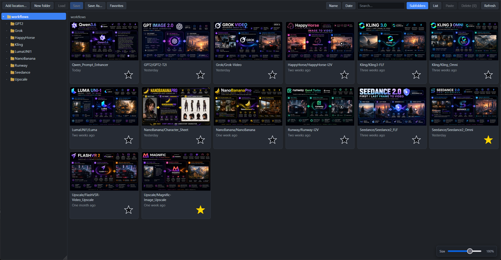
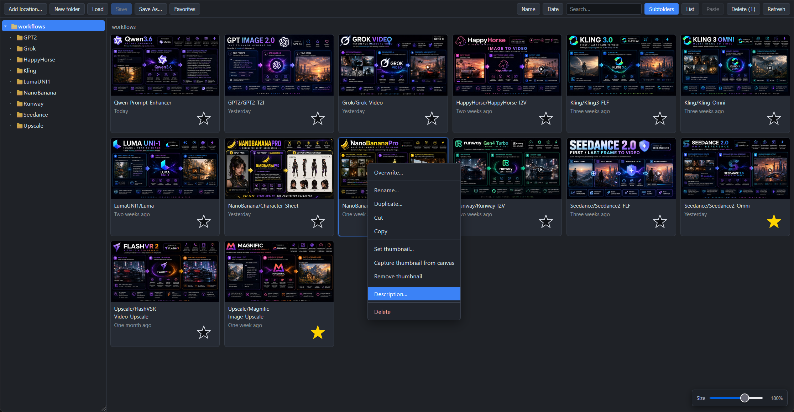
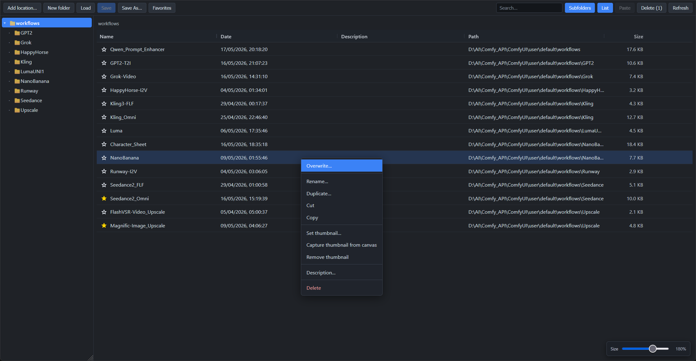
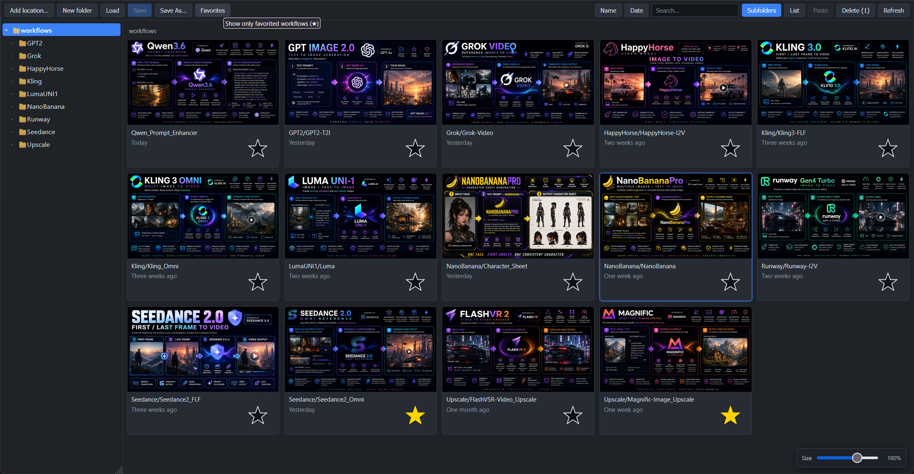
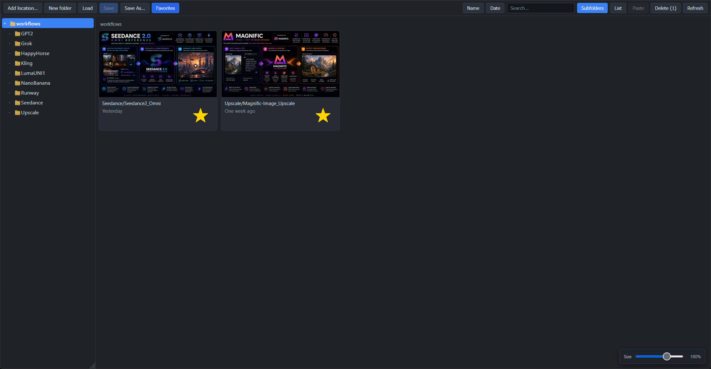

<div align="center">


# G-Workflows

**A fast, beautiful workflow browser & organizer for ComfyUI — that works on your *real* workflow files, not a private copy.**

[](LICENSE)
[](https://github.com/comfyanonymous/ComfyUI)
[-8957e5.svg)](#)
[](#)

</div>

---

G-Workflows opens in its own window from a 💾 button in the ComfyUI top bar and
gives you a real file manager for your workflows: a thumbnail gallery, a
details list, multi-location browsing, search, sorting, favorites,
descriptions, drag-and-drop, and a Save button smart enough to recognize the
workflow you already have open.

It reads and writes ComfyUI's **native `user/default/workflows/` folder** —
the exact same files as the built-in Workflows sidebar. No second library, no
hidden copies. Add as many extra folders from anywhere on your disk as you
like, and they all behave the same.

> **No graph nodes.** This is a pure front-end/back-end UI extension — it adds
> nothing to your node menu and changes nothing about how graphs run.

---

## ✨ Highlights

| | |
|---|---|
| 🗂️ **Real files** | Operates directly on `user/default/workflows/` — same files as ComfyUI's sidebar. No duplicate storage. |
| 📍 **Multiple locations** | Register any folder on your PC as an extra workflow root via a server-side folder browser. Each appears as its own tree. |
| 🖼️ **Thumbnail gallery** | Sidecar images paired by name. Set from a file, capture from the canvas, or drag-drop an image onto a card. Auto-normalized to a clean 800×450. |
| 🔎 **Global search** | An always-on search box filters by filename across **every** location at once. |
| ↕️ **Sort & views** | Card view with humanized dates ("2d ago", "Two months ago") + stackable **Name/Date** sort buttons; or a resizable, sortable **List** view. |
| 💾 **Smart Save** | Overwrites the file you loaded — and even lights up for workflows you opened the *normal* ComfyUI way, when you pick the matching thumbnail. |
| ⭐ **Favorites & notes** | Star workflows and add per-workflow descriptions, all stored as tiny sidecar files. |
| 🧰 **Full file ops** | New / rename / duplicate / cut-copy-paste / move / delete — folders too — with a confirmation on every delete. |
| 🎁 **Starter pack** | 40 ready-made thumbnails included so a fresh library looks great immediately. |

---

## 📸 Tour

### Multiple workflow locations, one gallery
Click **Add location…** to open a server-side folder browser (drives,
shortcuts, breadcrumb, or paste a path) and register any folder — even a
network/UNC share — as a peer workflow root. Each root gets its own
collapsible tree; an offline drive simply greys out instead of breaking the
panel. *"Remove this location"* only unregisters it — your files are never
touched.



### Thumbnails that just work
Workflows pair with a sidecar image by name (`Portrait.json` ↔
`Portrait.jpg`). Set one from a file, **capture the current canvas**, or drag
an image straight onto a card. Everything the panel writes is normalized to a
crisp **800×450 JPEG**, and thumbnails follow the workflow through every
rename / copy / move / delete. "Remove thumbnail" keeps the image on disk
(renamed `.removed`) so nothing is ever silently destroyed.



### Search, sort, and two ways to look
A persistent **Search** box filters by filename across *all* your registered
locations. In card view, the **Name** and **Date** buttons are independent
3-state toggles (`A to Z → Z to A → off`, `Newest → Oldest → off`) and can be
**stacked**. Prefer details? The **List** view gives Name / Date / Description
/ Path / Size with resizable, click-to-sort columns. The size slider scales
card thumbnails *and* list text.



### A Save button that pays attention
**Save** overwrites the file the workflow came from. The clever part: even if
you opened a workflow the *normal* ComfyUI way (a native tab, drag-drop),
Save activates the moment you select the thumbnail whose name matches — and
deactivates the instant you switch to a differently-named open workflow. One
**Save As…** (its filename pre-filled from whatever workflow is actually
open) and a **Load** button round it out.



### Favorites, descriptions, and bulk editing
Star your go-to workflows and filter to just those. Add a short description
that shows on the card. Multi-select with **Ctrl-click** (toggle) and
**Shift-click** (range, in the order you see them) to cut / copy / move /
delete in bulk — with a confirmation modal on every delete.



---

## 📦 Install

**Via ComfyUI-Manager (recommended)** — *Install via Git URL*:

```
https://github.com/AI4VFX/comfyui-g-workflows
```

**Manual:**

```bash
cd ComfyUI/custom_nodes
git clone https://github.com/AI4VFX/comfyui-g-workflows.git
```

Then **fully restart ComfyUI** (close/Ctrl-C the launcher and re-run it — a
browser refresh does *not* reload a custom node's Python) and hard-reload the
browser (Ctrl+Shift+R). Click the **💾** button in the top bar to open the
window.

Bundle layout expected by ComfyUI:

```
ComfyUI/custom_nodes/comfyui-g-workflows/
├── __init__.py            # aiohttp backend (routes under /comfy_greg_templates/*)
├── js/g_workflows.js       # the entire UI (served as a web extension)
├── pyproject.toml
├── LICENSE
├── README.md
├── docs/                   # README images
└── sample-thumbnails/      # 40 ready-to-use starter thumbnails
```

No extra dependencies — it uses only the Python standard library plus
`aiohttp` and `Pillow`, both of which already ship with ComfyUI.

---

## 🎁 Starter thumbnails

`sample-thumbnails/` contains **40 hand-made 800×450 thumbnails** named after
common workflow types (e.g. `Batch_Upscale.jpg`, `LTX-T2V.jpg`,
`QwenPromptEnhancer.jpg`). Use them to give a fresh library an instant
look:

- **Pairing:** drop one next to a workflow with the same base name
  (`LTX-T2V.jpg` next to `LTX-T2V.json`) and it shows up automatically, or
- **Manual:** right-click any workflow → **Set thumbnail…** and pick one.

They're already in the panel's native 800×450 JPEG format, so they look
consistent with thumbnails you set or capture yourself.

---

## 🤝 Living next to ComfyUI's built-in Workflows sidebar

Both read the same folder, so they show the same files.

- ComfyUI doesn't auto-refresh on disk changes — after this panel renames /
  moves / deletes, the native sidebar may look stale until a browser reload.
  No data is harmed. (The panel pings ComfyUI's userdata cache after writes
  to minimize this.)
- A workflow open in a tab whose file you delete/rename here keeps its
  in-memory graph; you just won't be able to plain-Save back to the old path.
- Filenames may not contain `: \ / * ? " < > |` (same rule as ComfyUI), and
  dot-files / dot-folders are hidden from the panel.

---

## 🔌 API surface

Everything is served under `/comfy_greg_templates/*` and every file
operation is confined to the selected location via `os.path.commonpath`
(per-root path-traversal protection). Delete routes require an explicit
`confirm: true`.

| Method | Route | Purpose |
|---|---|---|
| GET  | `/tree`         | all locations + recursive folder/file trees (sidecar-paired) |
| GET  | `/workflow`     | `?path=&root=` read a workflow's JSON |
| GET  | `/thumb`        | `?path=&root=` serve a sidecar image |
| POST | `/save`         | write a workflow (+ optional thumbnail) |
| POST | `/save_thumb`   | replace a workflow's sidecar thumbnail |
| POST | `/delete_thumb` | soft-remove a thumbnail (renamed `.removed`) |
| POST | `/set_desc`     | set / clear a workflow's description sidecar |
| POST | `/set_fav`      | set / clear a workflow's favorite marker |
| POST | `/rename`       | rename / move a workflow (+ its sidecars) |
| POST | `/copy`         | copy a workflow (+ its sidecars) |
| POST | `/move`         | bulk cross-folder move |
| POST | `/delete`       | bulk delete workflows (+ sidecars) |
| POST | `/mkdir`        | create a folder |
| POST | `/rmdir`        | delete a folder (`recursive` for non-empty) |
| POST | `/rename_dir`   | rename a folder |
| GET  | `/fs_roots`     | drives + shortcuts for the folder browser |
| GET  | `/fs_list`      | `?path=` list directories for the folder browser |
| GET  | `/list_roots`   | registered locations snapshot |
| POST | `/add_root`     | register a new location |
| POST | `/remove_root`  | unregister a location (files left on disk) |

Registered extra locations are persisted server-side to
`ComfyUI/user/g_workflows_roots.json` (an allowlist — only folders you add
are ever reachable).

---

## 📄 License & credits

MIT — see [`LICENSE`](LICENSE).

A rewrite inspired by
[comfyui-my-templates](https://github.com/trelohra-hash/comfyui-my-templates)
(MIT, © 2026 trelohra-hash / Antonis Nikolaou). Thank you.

---

<div align="center">
<sub>💾 G-Workflows — open it from the top bar and never lose a workflow again.</sub>
</div>
