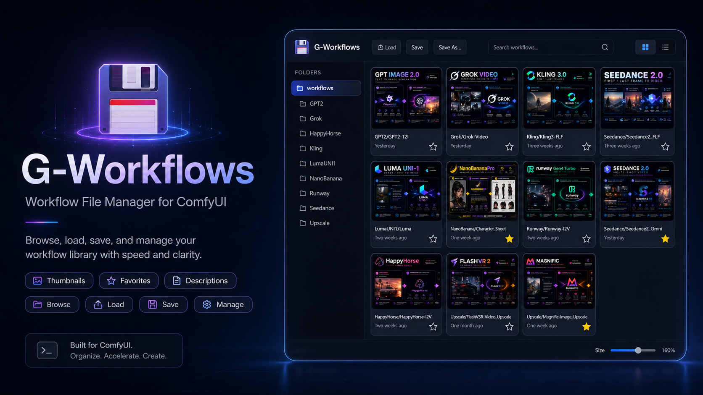
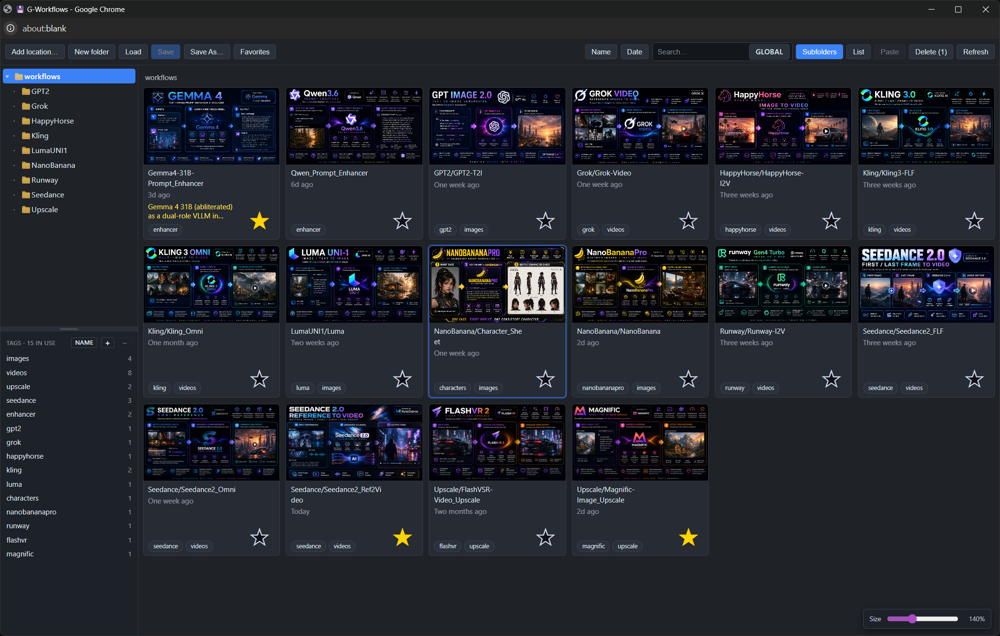
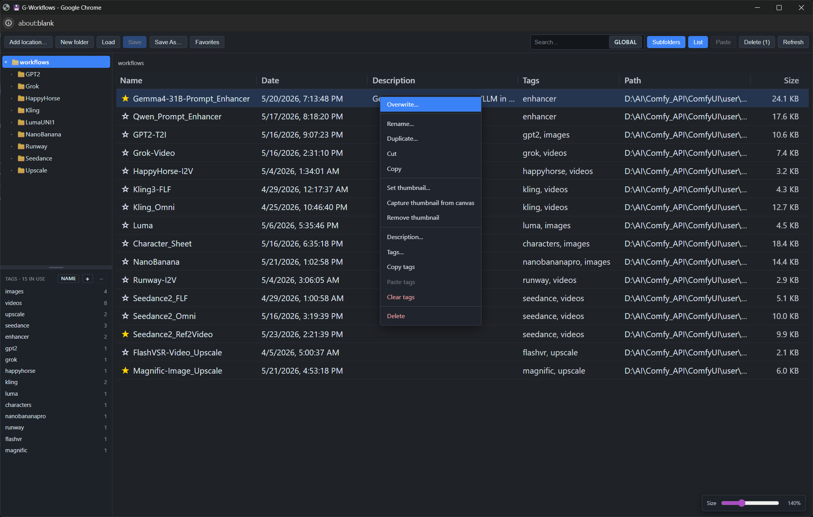
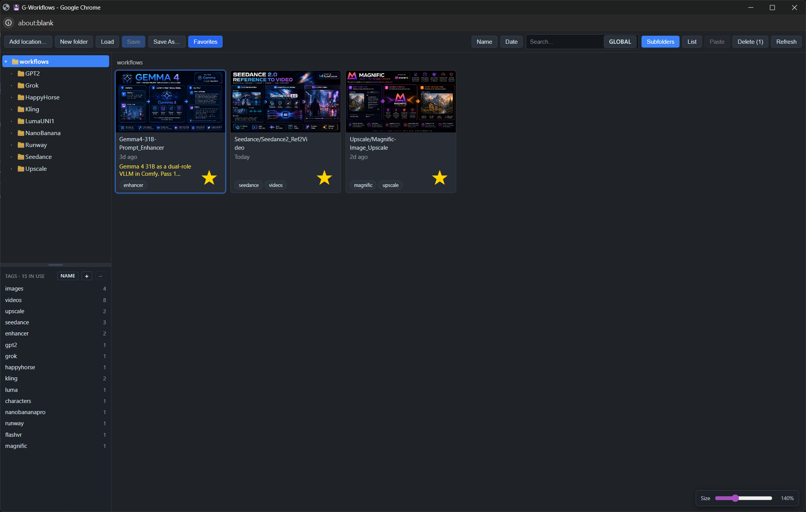
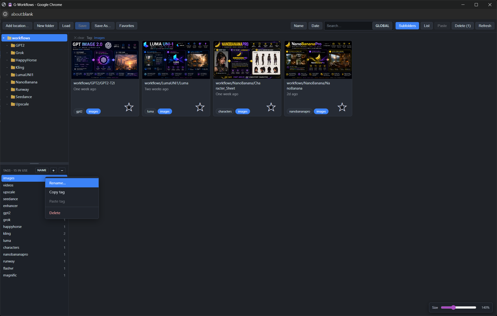
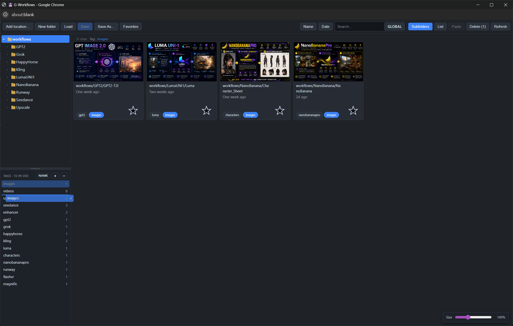
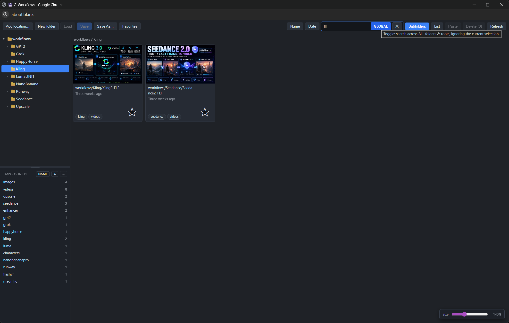
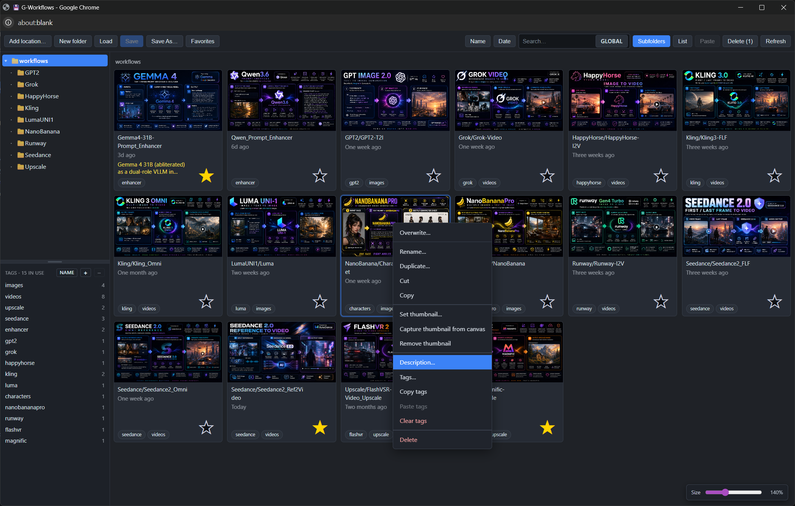

<div align="center">



# G-Workflows

**A fast, beautiful workflow browser & organizer for ComfyUI — that works on your *real* workflow files, not a private copy.**

[](LICENSE)
[](https://github.com/comfyanonymous/ComfyUI)
[-8957e5.svg)](#)
[](#)

</div>

---

G-Workflows opens in its own window from a 💾 button in the ComfyUI top bar
and gives you a real file manager for your workflows: a thumbnail gallery, a
details list, multi-location browsing, focused or global search, sorting,
favorites, descriptions, **tags** with a dedicated pane and cross-root
filtering, drag-and-drop, and a Save button smart enough to recognize the
workflow you already have open.

It reads and writes ComfyUI's **native `user/default/workflows/` folder** —
the exact same files as the built-in Workflows sidebar. No second library,
no hidden copies. Add as many extra folders from anywhere on your disk as
you like, and they all behave the same.

> **No graph nodes.** This is a pure front-end/back-end UI extension — it
> adds nothing to your node menu and changes nothing about how graphs run.

---

## ✨ Highlights

| | |
|---|---|
| 🗂️ **Real files** | Operates directly on `user/default/workflows/` — same files as ComfyUI's sidebar. No duplicate storage. |
| 📍 **Multiple locations** | Register any folder on your PC as an extra workflow root via a server-side folder browser. Each appears as its own tree. |
| 🖼️ **Thumbnail gallery** | Sidecar images paired by name. Set from a file, capture from the canvas, or drag-drop an image onto a card. Auto-normalized to a clean 800×450. |
| 🏷️ **Tags** | A dedicated tag pane in the left sidebar with live counts. Click a tag → see every workflow that has it across **all** roots. Add tags via a chip-input editor with autocomplete, drag workflows onto a tag to assign, drag tag rows to reorder, sort A-Z / Z-A / custom. Rename or delete globally. |
| 🔎 **Search — focused or global** | The search box narrows the current view by default (respects folder, Subfolders, Favorites). Flip the in-box **Global** toggle to scan every root at once, ignoring folder selection. |
| ↕️ **Sort & views** | Card view with humanized dates ("2d ago", "Two months ago") + stackable **Name/Date** sort buttons; or a resizable **List** view with sortable Name / Date / Description / Tags / Path / Size columns. |
| 💾 **Smart Save** | Overwrites the file you loaded — and even lights up for workflows you opened the *normal* ComfyUI way, when you pick the matching thumbnail. |
| ⭐ **Favorites & notes** | Star workflows and add per-workflow descriptions, all stored as tiny sidecar files. |
| 🧰 **Full file ops** | New / rename / duplicate / cut-copy-paste / move / delete — folders too — with a confirmation on every delete. |
| 🖱️ **One-click editors** | In List view, a single click on the Description or Tags cell opens the corresponding editor immediately. |
| 🎁 **Starter pack** | 40 ready-made thumbnails included so a fresh library looks great immediately. |

---

## 📸 Tour

### Multiple workflow locations, one gallery

Click **Add location…** to open a server-side folder browser (drives,
shortcuts, breadcrumb, or paste a path) and register any folder — even a
network/UNC share — as a peer workflow root. Each root gets its own
collapsible tree; an offline drive simply greys out instead of breaking the
panel. *"Remove this location"* only unregisters it — your files are never
touched.

The left sidebar is split: **folders on top, tags on bottom**, with a
drag handle between them. Drag to resize; your split position is
remembered.



### List view

Switch to **List** for a dense, sortable details view: Name, Date,
Description, **Tags**, Path, Size. Every column header is sortable (3-state:
none → ▲ → ▼) and every column is resizable. Single-click on the
Description or Tags cell opens that workflow's editor immediately — no
double-click needed. Empty cells stay clickable.



### Save / Save As / Load

**Save** overwrites the file the workflow came from. The clever part: even
if you opened a workflow the *normal* ComfyUI way (a native tab, drag-drop),
Save activates the moment you select the thumbnail whose name matches — and
deactivates the instant you switch to a differently-named open workflow.
**Save As…** opens a picker that pre-fills the filename from whatever
workflow is actually open, and shows the existing files in the chosen
folder so you can pick one to overwrite by name. **Load** opens the
single selected workflow. Closing a tab whose file you just overwrote via
Save no longer pesters you with "Save changes?" — the panel correctly
clears ComfyUI's native dirty flag after writing.

### Favorites & bulk operations

Star your go-to workflows and filter to just those with a single click.
Multi-select with **Ctrl-click** (toggle) and **Shift-click** (range, in
the order you see them) to cut / copy / move / delete in bulk — with a
confirmation modal on every delete.



### Tags

Tags are the headline feature. Each workflow can carry any number of
lowercased free-form tags stored in a tiny `<stem>.tags.txt` sidecar
(parallels the existing `.desc.txt` / `.fav` sidecars and follows the
workflow through every rename / copy / move / delete).

**Editing.** Right-click any workflow → **Tags…** (or single-click the
Tags cell in List view, or click the dashed `(no tags)` placeholder on
a card) to open a **chip-input editor**. Type a tag and press Enter or
comma to add it; press × to remove. As you type, an **autocomplete
dropdown** suggests existing tags from across all your roots so you can
reuse the same spelling. Ctrl+Enter saves.

**The tag pane.** The bottom half of the sidebar lists every distinct
tag with a live workflow count (`Tags · N in use`). Click a tag → the
grid flips to a **cross-root flat view** showing every workflow that has
that tag, no matter which folder or root it lives in. The breadcrumb
slot displays *`✕ clear  Tag: <name>`* while the filter is active.
Click the active tag again, the ✕, or any folder to exit.



**Sort & reorder.** The **Name** button cycles `default → A-Z → Z-A →
default`. In default mode you can **drag tag rows up and down** to
choose the order yourself; the custom order is remembered.



**Drag-to-assign.** Drag one (or several Ctrl-selected) workflow
cards/rows onto a tag in the pane to assign that tag — merges into the
workflow's existing tag list, never destroys.

**Add / delete.** `+` in the pane header opens a prompt to add a new
empty tag (a "draft" — shown italic, count 0). Drag workflows onto it
to populate. `−` deletes the currently-active tag globally (with a
confirmation; workflow files are never touched, only the tag
associations are removed).

**Right-click on a tag row** for **Rename…** (global), **Copy tag**,
**Paste tag** (applies to currently-selected workflows), and **Delete**.

**Right-click on a workflow** for the per-workflow operations:
**Tags…** opens the editor; **Copy tags** / **Paste tags** moves a
workflow's whole tag list onto other selected workflows; **Clear tags**
strips every tag from the selection (with confirmation).

**See it in action:**

<video src="docs/Tags_Search_and_More.mp4" controls preload="metadata" width="100%"></video>

[▶ Direct link to the demo video](docs/Tags_Search_and_More.mp4)

### Search — focused or global

The search box lives in the toolbar and is always visible. By default it
narrows the **current view** (current root + folder ± Subfolders ±
Favorites composed). Need to find something across every registered root?
Flip the in-box **Global** toggle and search ignores folder + root
selection entirely, scanning every workflow tree. The toggle is
persistent — flip it once and the panel stays in that mode until you
flip it back.



### Right-click is where the power lives

Right-click any workflow card or list row to get every per-workflow
operation in one menu: Overwrite, Rename, Duplicate, Cut, Copy, thumbnail
management, Description, Tags, Copy/Paste/Clear tags, Delete. Multi-select
first to apply bulk operations.



---

## 📦 Install

**Via ComfyUI-Manager (recommended)** — *Install via Git URL*:

```
https://github.com/AI4VFX/comfyui-g-workflows
```

**Manual:**

```bash
cd ComfyUI/custom_nodes
git clone https://github.com/AI4VFX/comfyui-g-workflows.git
```

Then **fully restart ComfyUI** (close/Ctrl-C the launcher and re-run it — a
browser refresh does *not* reload a custom node's Python) and hard-reload the
browser (Ctrl+Shift+R). Click the **💾** button in the top bar to open the
window.

Bundle layout expected by ComfyUI:

```
ComfyUI/custom_nodes/comfyui-g-workflows/
├── __init__.py            # aiohttp backend (routes under /comfy_greg_templates/*)
├── js/g_workflows.js       # the entire UI (served as a web extension)
├── pyproject.toml
├── LICENSE
├── README.md
├── docs/                   # README images + demo video
└── sample-thumbnails/      # 40 ready-to-use starter thumbnails
```

No extra dependencies — it uses only the Python standard library plus
`aiohttp` and `Pillow`, both of which already ship with ComfyUI.

---

## 🎁 Starter thumbnails

`sample-thumbnails/` contains **40 hand-made 800×450 thumbnails** named after
common workflow types (e.g. `Batch_Upscale.jpg`, `LTX-T2V.jpg`,
`QwenPromptEnhancer.jpg`). Use them to give a fresh library an instant
look:

- **Pairing:** drop one next to a workflow with the same base name
  (`LTX-T2V.jpg` next to `LTX-T2V.json`) and it shows up automatically, or
- **Manual:** right-click any workflow → **Set thumbnail…** and pick one.

They're already in the panel's native 800×450 JPEG format, so they look
consistent with thumbnails you set or capture yourself.

---

## 🤝 Living next to ComfyUI's built-in Workflows sidebar

Both read the same folder, so they show the same files.

- ComfyUI doesn't auto-refresh on disk changes — after this panel renames /
  moves / deletes, the native sidebar may look stale until a browser reload.
  No data is harmed. (The panel pings ComfyUI's userdata cache after writes
  to minimize this.)
- A workflow open in a tab whose file you delete/rename here keeps its
  in-memory graph; you just won't be able to plain-Save back to the old path.
- Filenames may not contain `: \ / * ? " < > |` (same rule as ComfyUI), and
  dot-files / dot-folders are hidden from the panel.

---

## 🔌 API surface

Everything is served under `/comfy_greg_templates/*` and every file
operation is confined to the selected location via `os.path.commonpath`
(per-root path-traversal protection). Delete routes require an explicit
`confirm: true`.

| Method | Route | Purpose |
|---|---|---|
| GET  | `/tree`         | all locations + recursive folder/file trees (sidecar-paired; carries `description`, `favorite`, `tags`) |
| GET  | `/workflow`     | `?path=&root=` read a workflow's JSON |
| GET  | `/thumb`        | `?path=&root=` serve a sidecar image |
| POST | `/save`         | write a workflow (+ optional thumbnail) |
| POST | `/save_thumb`   | replace a workflow's sidecar thumbnail |
| POST | `/delete_thumb` | soft-remove a thumbnail (renamed `.removed`) |
| POST | `/set_desc`     | set / clear a workflow's description sidecar |
| POST | `/set_fav`      | set / clear a workflow's favorite marker |
| POST | `/set_tags`     | overwrite a workflow's tags sidecar (empty list deletes the sidecar) |
| POST | `/rename_tag`   | globally rename a tag across every workflow in every root (merges duplicates) |
| POST | `/delete_tag`   | globally remove a tag from every workflow that has it |
| POST | `/rename`       | rename / move a workflow (+ its sidecars) |
| POST | `/copy`         | copy a workflow (+ its sidecars) |
| POST | `/move`         | bulk cross-folder move |
| POST | `/delete`       | bulk delete workflows (+ sidecars) |
| POST | `/mkdir`        | create a folder |
| POST | `/rmdir`        | delete a folder (`recursive` for non-empty) |
| POST | `/rename_dir`   | rename a folder |
| GET  | `/fs_roots`     | drives + shortcuts for the folder browser |
| GET  | `/fs_list`      | `?path=` list directories for the folder browser |
| GET  | `/list_roots`   | registered locations snapshot |
| POST | `/add_root`     | register a new location |
| POST | `/remove_root`  | unregister a location (files left on disk) |

Registered extra locations are persisted server-side to
`ComfyUI/user/g_workflows_roots.json` (an allowlist — only folders you add
are ever reachable). Tags live in `<stem>.tags.txt` next to each workflow,
one tag per line, lowercased and de-duplicated on save.

---

## 📄 License & credits

MIT — see [`LICENSE`](LICENSE).

A rewrite inspired by
[comfyui-my-templates](https://github.com/trelohra-hash/comfyui-my-templates)
(MIT, © 2026 trelohra-hash / Antonis Nikolaou). Thank you.

---

<div align="center">
<sub>💾 G-Workflows — open it from the top bar and never lose a workflow again.</sub>
</div>
