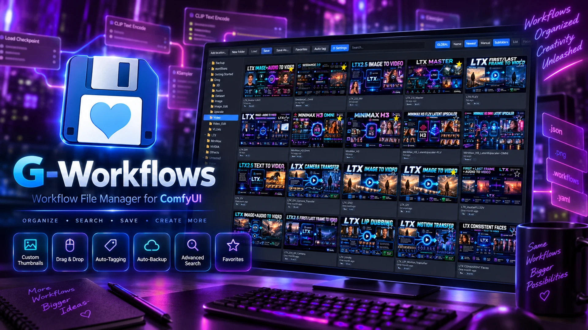
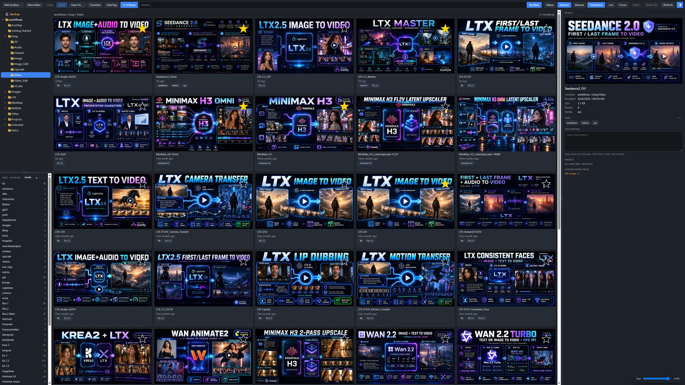
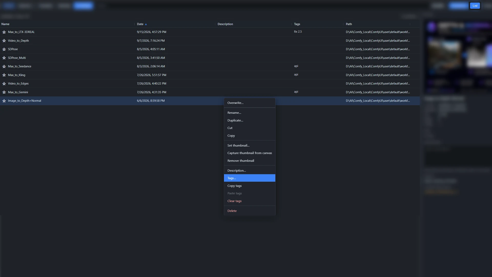
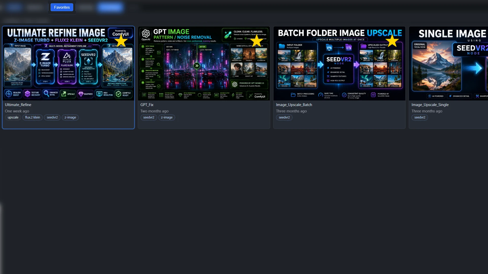
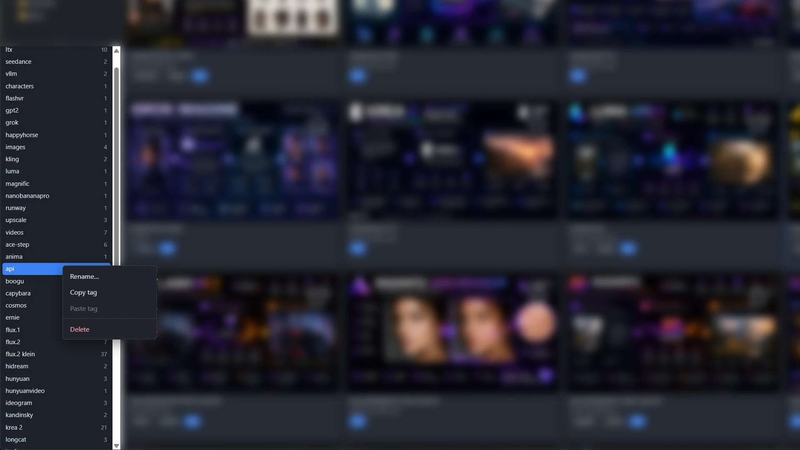
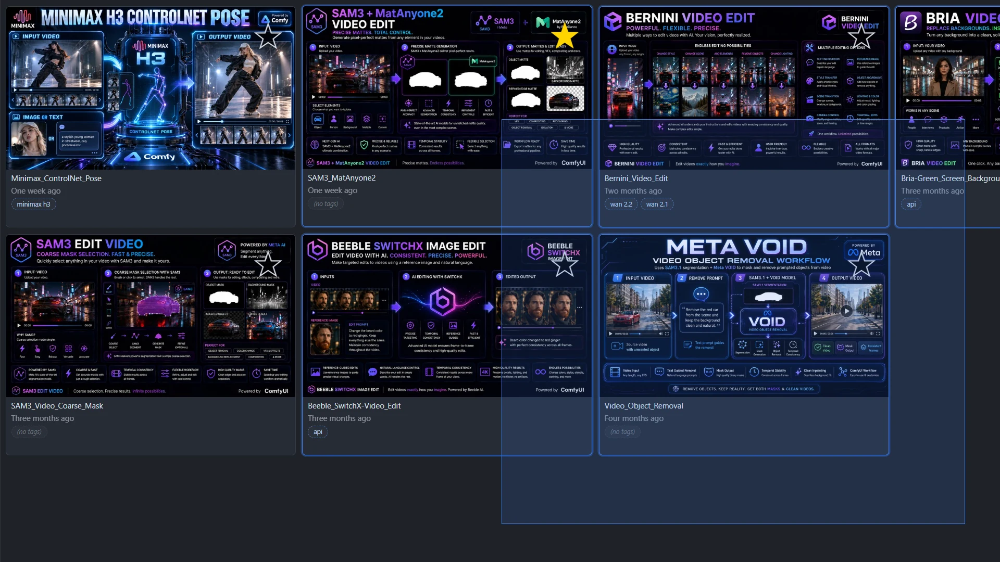
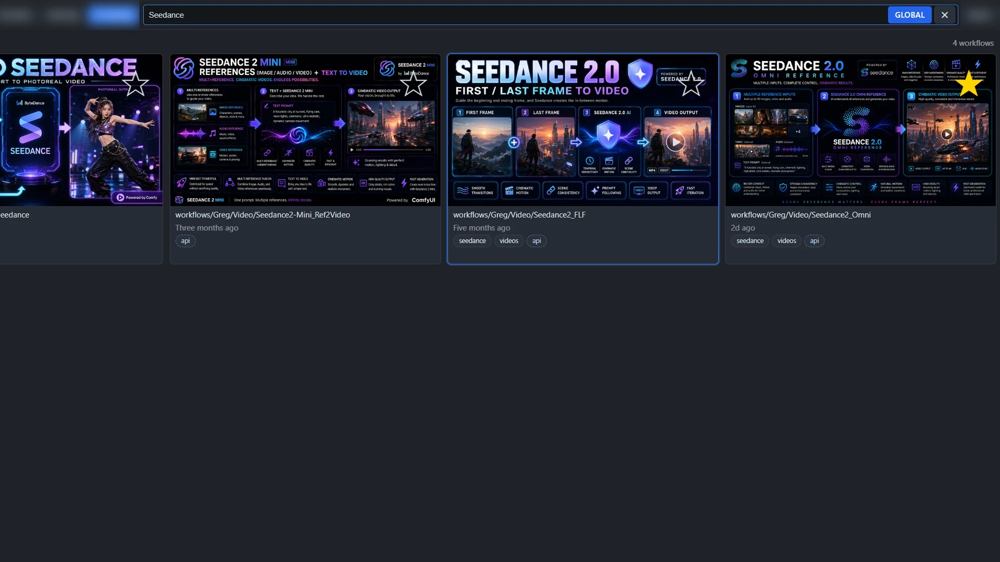
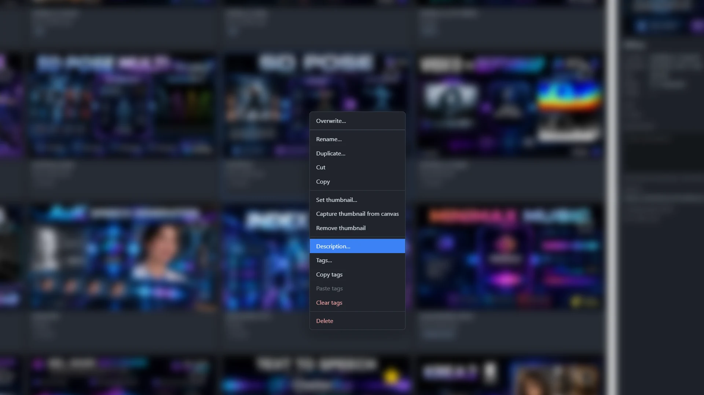

<div align="center">



# G-Workflows

**A fast, beautiful workflow browser & organizer for ComfyUI — that works on your *real* workflow files, not a private copy.**

[](LICENSE)
[](https://github.com/comfyanonymous/ComfyUI)
[-8957e5.svg)](#)
[](#)

</div>

---

G-Workflows opens in its own window from the disk icon in the ComfyUI top bar
and gives you a real file manager for your workflows: a thumbnail gallery, a
details list, a **Details panel** that reads each graph for you, multi-location
browsing, focused or global search, sorting — by name, by date, or **by hand**
— favorites, descriptions, **tags** (yours, plus the ones **AutoTag** works
out from the models a workflow loads), drag-and-drop everywhere, and a Save
button smart enough to recognize the workflow you already have open.

It reads and writes ComfyUI's **native `user/default/workflows/` folder** —
the exact same files as the built-in Workflows sidebar. No second library,
no hidden copies. Add as many extra folders from anywhere on your disk as
you like, and they all behave the same.

> **No graph nodes.** This is a pure front-end/back-end UI extension — it
> adds nothing to your node menu and changes nothing about how graphs run.

---

## ✨ Highlights

| | |
|---|---|
| 🗂️ **Real files** | Operates directly on `user/default/workflows/` — same files as ComfyUI's sidebar. No duplicate storage. |
| 📍 **Multiple locations** | Register any folder on your PC as an extra workflow root via a server-side folder browser. Each appears as its own tree. |
| 🖼️ **Thumbnail gallery** | Sidecar images paired by name. Set from a file, capture from the canvas, or drag-drop an image onto a card. Auto-normalized to a clean 800×450. |
| 🔍 **Details panel** | A resizable right-hand panel for the workflow you clicked: location, date, size, **node count**, **model family**, every model file it references, which **custom node packs** it needs (and any node type you don't have installed), its tags, and a description you edit right there. |
| 🏷️ **Tags & AutoTag** | A tag pane with live counts, a chip-input editor with autocomplete, drag-to-assign, global rename/delete. **AutoTag** scans every workflow and tags it with the model families it loads — `ltx 2.3`, `wan 2.2`, `flux.2 klein`, `z-image`, `api`, … — in its own sidecar, so the tags you typed are never touched. New saves get tagged automatically. |
| 🔎 **Search & tag filter — focused or global** | The search box and the tag filter both narrow the **current folder** (± Subfolders) by default. Flip the in-box **Global** toggle and either one scans every location at once. |
| ↕️ **Sort, arrange, select** | **Name** / **Date** sort, or **Manual**: drag cards into the order you want, per folder — the first drop switches to it. **Lasso** a group on empty space, **Ctrl** / **Shift** click to build a selection, and drive the whole gallery from the **keyboard**. |
| 🎯 **Focus** | One click hides everything but the thumbnails. Toolbar and folders stay, so you can still navigate. |
| ⭐ **Favorites, from anywhere** | Star workflows, filter to them, arrange them in the order you like — then **hold the top-bar icon** for a favorites menu that loads a workflow without opening the panel. |
| 💾 **Smart Save** | Overwrites the file you loaded — and even lights up for workflows you opened the *normal* ComfyUI way, when you pick the matching thumbnail. |
| 🛟 **Auto-backup & safety** | Optional rolling snapshots of the workflow you're editing into a pinned `_Backup` location — a per-workflow ring buffer you size yourself (every 1–60 min, keep 1–50). Plus a one-time heads-up if ComfyUI's AutoSave is set to silently overwrite the file you have open. |
| 🧰 **Full file ops** | New / rename / duplicate / cut-copy-paste / move / delete — folders too — with a confirmation on every delete. Or just **drag cards onto a folder** in the tree to move them (hold **Shift** to copy). Every sidecar travels with the file. |
| 🖱️ **One-click editors** | In List view, a single click on the Description or Tags cell opens the corresponding editor immediately. |
| 🎁 **Starter pack** | 135 ready-made 800×450 thumbnails included so a fresh library looks great immediately. |

---

## 📸 Tour

### Multiple workflow locations, one gallery

Click **Add location…** to open a server-side folder browser (drives,
shortcuts, breadcrumb, or paste a path) and register any folder — even a
network/UNC share — as a peer workflow root. Each root gets its own
collapsible tree; an offline drive simply greys out instead of breaking the
panel. *"Remove this location"* only unregisters it — your files are never
touched.

The left sidebar is split: **folders on top, tags on bottom**, with a drag
handle between them. The **Details** panel sits on the right (toggle it with
the ◨ button at the end of the toolbar, drag its edge to resize). Both
positions are remembered.



Turn on **Subfolders** to see a folder and everything beneath it as one flat
gallery:

https://github.com/user-attachments/assets/e00dd0ba-7baf-4e27-a320-99d2696b73fe

### The Details panel

Click any workflow and the panel on the right fills in: the thumbnail,
where it lives, when it was last modified, its size, how many **nodes** it
has (and how many are inside **subgraphs**), the **model family** it
belongs to, every **model file** it references, and the **custom node
packs** it depends on — with a red *Not installed* line if the graph uses a
node type nothing on your machine provides. Hosted **API nodes** (GPT,
Gemini, Seedance, Kling, …) are listed as their own group.

The **description** is a live text box: type, click away (or Ctrl+Enter),
saved. Esc reverts. Tags are pills — click one to filter, **Edit…** opens the
chip editor.

The analysis runs once per file on the server and is cached until the file
changes, so clicking around is instant.

https://github.com/user-attachments/assets/5cef35d0-8bfc-491e-b689-e7f140ea0ccc

### List view

Switch to **List** for a dense, sortable details view: Name, Date,
Description, **Tags**, Path, Size. Every column header is sortable (3-state:
none → ▲ → ▼) and every column is resizable. Single-click on the Description
or Tags cell opens that workflow's editor immediately — no double-click
needed. Empty cells stay clickable. The lower-right **Size** slider scales
the List text on its own scale (separate from the Thumbnail card size), and
the breadcrumb shows how many workflows are currently listed.



### Save / Save As / Load

**Save** overwrites the file the workflow came from. The clever part: even
if you opened a workflow the *normal* ComfyUI way (a native tab, drag-drop),
Save activates the moment you select the thumbnail whose name matches — and
deactivates the instant you switch to a differently-named open workflow.
**Save As…** opens a picker that pre-fills the filename from whatever
workflow is actually open, and shows the existing files in the chosen
folder so you can pick one to overwrite by name. Saving under a **new
name makes the open tab adopt that name**: a brand-new (never-saved)
workflow is renamed in place — same tab, no reload, undo/viewport
preserved — while an already-saved workflow opens under the new name as
the active tab with its original file left untouched on disk (matching
ComfyUI's own Save As). Either way, future plain **Save**s then target
the new file. **Load** opens the single selected workflow (or press
**Enter**). Closing a tab whose file you just overwrote via Save no longer
pesters you with "Save changes?" — the panel correctly clears ComfyUI's
native dirty flag after writing.

### Auto-backup & AutoSave safety

ComfyUI's built-in **Auto Save** ("after delay") quietly rewrites the workflow
you have *open* to its own file as you edit — so opening a workflow to derive a
variant can overwrite the **original** before you ever Save As. On first run,
G-Workflows shows a one-time notice (once per install) explaining this and lets
you disable Auto Save with one click. You can change it anytime in **ComfyUI
Settings → Comfy → Workflow → Auto Save**.

As a safety net, **⚙ Settings** in the panel toolbar enables G-Workflows'
own rolling **auto-backup**: on a timer (every **1–60 minutes**) it snapshots
the workflow you're editing into a single, pinned **`_Backup`** location at the
top of the locations list (`user/default/_Backup`, kept *outside* your
workflows). Backups are named after the workflow — `MyWorkflow.bak001.json`,
`.bak002.json`, … — as a per-workflow ring buffer of **N** (1–50): once full,
the oldest is recycled. Identical snapshots are skipped, and your original file
is **never** written by the backup — only explicit Save / Save As touches it.
To **restore**, open a backup from `_Backup` (it loads as an unsaved copy) and
**Save As** over the original.

### Sort, arrange by hand, select

**Name** and **Date** are 3-state sort buttons (`A to Z → Z to A → off`,
`Newest → Oldest → off`) and they stack — the one you pressed last leads,
the other breaks ties.

**Manual** is the third way: drag a card and drop it on another one — a blue
edge shows whether it lands before or after — or drop it on empty space to
send it to the end. The first drop switches the folder to Manual order;
pressing **Name** or **Date** leaves it, pressing **Manual** brings your
arrangement back. Each folder keeps its own order (and a separate one for
its Subfolders view) in a hidden `.gworder.json` next to the files. New
files simply append.

Selection works the way you expect: **click**, **Ctrl-click** to toggle,
**Shift-click** for a range in the order you see them, or press on empty
space and **drag a lasso** (Ctrl adds to what you have). A selected group
drags as one — the ghost shows a stack with a count badge — whether you're
arranging it, tagging it or moving it to a folder.

https://github.com/user-attachments/assets/8750887f-d5c8-4436-806c-f62c6fe08cac

https://github.com/user-attachments/assets/37f2c1e3-d726-4cd8-92bb-0eefbf391946

**Keyboard.** **← →** step through cards, **↑ ↓** move a row (a real grid
row — the panel reads the column count live), **Shift + arrows** extend the
range, **Home / End** jump, **Enter** loads. In List view ↑ ↓ walk the rows.
The search box has focus when the window opens, and ↑ ↓ work from there too,
so you never have to reach for the mouse first.

### Focus

**Focus** strips the gallery down to thumbnails — no names, dates, tags,
breadcrumb or Details panel. The toolbar and the folder tree stay so you can
keep navigating; hover a card for its name. Everything else (selection,
lasso, arranging, drag to folders) keeps working.

https://github.com/user-attachments/assets/9f8a4541-f32c-4e12-a697-e35509026878

### Favorites — in the panel and from the top bar

Star your go-to workflows and filter to just those with **Favorites**. With
**Manual** on, drag them into whatever order you like — favorites have one
global order that spans folders and locations.



Then, from the ComfyUI canvas: **press and hold the G-Workflows icon** in the
top bar (200 ms) and a menu of your favorites drops down in that same
order. Click one and it loads — the panel never opens. Drag rows in the menu
to rearrange them; the panel's Favorites view follows. Click away or Esc to
close. A plain click still opens the window.

https://github.com/user-attachments/assets/d30417e3-cf2b-4242-ae50-7fc302c19c3c

### Tags

Each workflow can carry any number of lowercased free-form tags, stored in
a tiny `<stem>.tags.txt` sidecar (parallels the `.desc.txt` / `.fav`
sidecars and follows the workflow through every rename / copy / move /
delete).

**Editing.** Right-click any workflow → **Tags…** (or single-click the
Tags cell in List view, click the dashed `(no tags)` placeholder on a card,
or **Edit…** in the Details panel) to open a **chip-input editor**. Type a
tag and press Enter or comma to add it; press × to remove. As you type, an
**autocomplete dropdown** suggests existing tags from across all your roots
so you can reuse the same spelling. Ctrl+Enter saves.

**The tag pane.** The bottom half of the sidebar lists every distinct tag
with a live workflow count (`Tags · N in use`). Click a tag and the gallery
narrows to the workflows that carry it **in the current folder** (plus its
subfolders, if **Subfolders** is on) — the breadcrumb keeps the path and
shows a small `✕ clear · Tag: <name>` chip beside it. Click other folders
and the filter follows you. Want it across **every** location? Turn on the
search box's **Global** toggle: the tag filter then spans all your roots,
exactly like a global search. Click the active tag again or the ✕ to exit.



**Sort & reorder.** The **Name** button in the pane header cycles
`default → A-Z → Z-A → default`. In default mode you can **drag tag rows up
and down** to choose the order yourself; the custom order is remembered.

**Drag-to-assign.** Drag one (or several selected) workflow cards/rows onto
a tag in the pane to assign that tag — merges into the workflow's existing
tag list, never destroys.



**Add / delete.** `+` in the pane header adds a new empty tag (a "draft" —
shown italic, count 0). Drag workflows onto it to populate. `−` deletes the
currently-active tag globally (with a confirmation; workflow files are never
touched, only the tag associations are removed).

**Right-click on a tag row** for **Rename…** (global), **Copy tag**, **Paste
tag** (applies to currently-selected workflows), and **Delete**.

**Right-click on a workflow** for the per-workflow operations: **Tags…**
opens the editor; **Copy tags** / **Paste tags** moves a workflow's tag list
onto other selected workflows; **Clear tags** strips every tag from the
selection (with confirmation).

https://github.com/user-attachments/assets/8a9ad504-462c-4efc-a16b-9b4d07b2560b

### AutoTag

Press **AutoTag** and G-Workflows reads every workflow in every location,
finds the model files its loader nodes reference, and tags each one with the
**family** those models belong to: `ltx 2.3`, `ltx 2.5`, `wan 2.1`,
`wan 2.2`, `flux.1`, `flux.2`, `flux.2 klein`, `qwen-image`,
`qwen-image-edit`, `z-image`, `krea 2`, `minimax h3`, `seedvr2`, `sdxl`,
`sd1.5`, `hunyuan`, `hidream`, `ace-step`, `stable audio`, `cosmos`,
`mochi`, and more — plus **`api`** for any graph that runs ComfyUI's hosted
API nodes. Graphs built from subgraphs are read all the way down; a renamed
finetune the rules can't place falls back to what its LoRA / VAE / text
encoder names say.

Auto tags show as **dashed pills** and live in their own sidecar,
`<stem>.autotags.txt`. **Your tags are never touched**: the editor shows
auto tags read-only below the ones you typed, and copy / paste / clear /
drag-to-assign only ever work on your list. Rename or delete a tag from the
pane and it applies to both.

You rarely need the button twice. Every **Save / Save As** through the panel
tags the file on the spot, and any workflow saved by ComfyUI itself is
picked up the next time the panel refreshes (it re-reads only files whose
size or date moved). Tag pane counts and filters include auto tags, so
"show me everything that runs on `wan 2.2`" is one click.

https://github.com/user-attachments/assets/2a776360-998e-4873-9b30-2101c8431d51

### Search — focused or global

The search box fills the middle of the toolbar and is always visible. By
default it narrows the **current view** (current root + folder ± Subfolders
± Favorites composed). Need to find something across every registered root?
Flip the in-box **Global** toggle and search ignores folder + root selection
entirely, scanning every workflow tree — and the tag filter follows the same
switch. The toggle is persistent — flip it once and the panel stays in that
mode until you flip it back.



### Right-click is where the power lives

Right-click any workflow card or list row to get every per-workflow
operation in one menu: Overwrite, Rename, Duplicate, Cut, Copy, thumbnail
management, Description, Tags, Copy/Paste/Clear tags, Delete. Multi-select
first to apply bulk operations. And for the most common move of all — putting
a workflow in a different folder — just **drag it onto the folder** in the
tree (**Shift** while dropping copies instead). File, thumbnail, description,
favorite marker, tags and auto tags all go together.



---

## 📦 Install

**Via ComfyUI-Manager (recommended)** — *Install via Git URL*:

```
https://github.com/AI4VFX/comfyui-g-workflows
```

**Manual:**

```bash
cd ComfyUI/custom_nodes
git clone https://github.com/AI4VFX/comfyui-g-workflows.git
```

Then **fully restart ComfyUI** (close/Ctrl-C the launcher and re-run it — a
browser refresh does *not* reload a custom node's Python) and hard-reload the
browser (Ctrl+Shift+R). Click the G-Workflows disk icon in the top bar to open
the window — or hold it for your favorites.

Bundle layout expected by ComfyUI:

```
ComfyUI/custom_nodes/comfyui-g-workflows/
├── __init__.py            # aiohttp backend (routes under /comfy_greg_templates/*)
├── js/g_workflows.js       # the entire UI (served as a web extension)
├── js/gw-icon.png          # top-bar icon
├── js/blank.html           # the popup window's page
├── pyproject.toml
├── LICENSE
├── README.md
├── docs/                   # README images + feature clips
└── sample-thumbnails/      # 135 ready-to-use starter thumbnails
```

No extra dependencies — it uses only the Python standard library plus
`aiohttp` and `Pillow`, both of which already ship with ComfyUI.

**Upgrading from 1.x:** nothing to migrate. Your tags, descriptions,
favorites and thumbnails are read as they are; the first refresh after the
upgrade analyses your library once (a second or two for a few hundred
workflows) and writes the auto-tag sidecars.

---

## 🎁 Starter thumbnails

`sample-thumbnails/` contains **135 hand-made 800×450 thumbnails** named after
common workflow types (e.g. `Background_Removal.jpg`, `LTX-T2V.jpg`,
`ZImageTurbo.jpg`). Use them to give a fresh library an instant look:

- **Pairing:** drop one next to a workflow with the same base name
  (`LTX-T2V.jpg` next to `LTX-T2V.json`) and it shows up automatically, or
- **Manual:** right-click any workflow → **Set thumbnail…** and pick one.

They're already in the panel's native 800×450 JPEG format, so they look
consistent with thumbnails you set or capture yourself.

---

## 🤝 Living next to ComfyUI's built-in Workflows sidebar

Both read the same folder, so they show the same files.

- ComfyUI doesn't auto-refresh on disk changes — after this panel renames /
  moves / deletes, the native sidebar may look stale until a browser reload.
  No data is harmed. (The panel pings ComfyUI's userdata cache after writes
  to minimize this.)
- A workflow open in a tab whose file you delete/rename here keeps its
  in-memory graph; you just won't be able to plain-Save back to the old path.
- Filenames may not contain `: \ / * ? " < > |` (same rule as ComfyUI), and
  dot-files / dot-folders are hidden from the panel.

### What the panel writes next to your workflows

Everything G-Workflows knows about a workflow lives beside it as small
plain-text sidecars, so it survives any tool and needs no database:

| File | What it is |
|---|---|
| `<stem>.jpg` / `.png` / `.webp` | the thumbnail |
| `<stem>.desc.txt` | the description |
| `<stem>.fav` | present = favorite |
| `<stem>.tags.txt` | your tags, one per line |
| `<stem>.autotags.txt` | AutoTag's family tags — rewritten by the scanner, never by you |
| `.gworder.json` / `.gworder-subfolders.json` | a folder's manual card order (hidden) |

And in `ComfyUI/user/`: `g_workflows_roots.json` (your extra locations),
`g_workflows_meta.json` (first-run flags + the global favorites order) and
`g_workflows_analysis.json` (the per-file analysis cache — safe to delete,
it rebuilds).

---

## 🔌 API surface

Everything is served under `/comfy_greg_templates/*` and every file
operation is confined to the selected location via `os.path.commonpath`
(per-root path-traversal protection). Delete routes require an explicit
`confirm: true`.

| Method | Route | Purpose |
|---|---|---|
| GET  | `/tree`         | all locations + recursive folder/file trees (sidecar-paired; carries `description`, `favorite`, `tags` (merged), `manualTags`, `autoTags`; folders carry `order` / `orderRecurse`) |
| GET  | `/workflow`     | `?path=&root=` read a workflow's JSON |
| GET  | `/thumb`        | `?path=&root=` serve a sidecar image |
| GET  | `/analysis`     | `?path=&root=` node count, subgraphs, model files, families, custom packs, API nodes, not-installed types (cached per file) |
| POST | `/autotag_all`  | re-analyse every workflow in every location and rewrite the auto-tag sidecars |
| POST | `/save`         | write a workflow (+ optional thumbnail); auto-tags it |
| POST | `/save_thumb`   | replace a workflow's sidecar thumbnail |
| POST | `/delete_thumb` | soft-remove a thumbnail (renamed `.removed`) |
| POST | `/set_desc`     | set / clear a workflow's description sidecar |
| POST | `/set_fav`      | set / clear a workflow's favorite marker |
| POST | `/set_tags`     | overwrite a workflow's manual tags sidecar (auto tags untouched; empty list deletes the sidecar) |
| POST | `/set_order`    | store a folder's manual card order (`recurse` for the Subfolders view) |
| POST | `/rename_tag`   | globally rename a tag across every workflow in every root, manual and auto (merges duplicates) |
| POST | `/delete_tag`   | globally remove a tag from every workflow that has it |
| POST | `/rename`       | rename / move a workflow (+ its sidecars) |
| POST | `/copy`         | copy a workflow (+ its sidecars) |
| POST | `/move`         | bulk cross-folder move (+ sidecars) |
| POST | `/delete`       | bulk delete workflows (+ sidecars) |
| POST | `/mkdir`        | create a folder |
| POST | `/rmdir`        | delete a folder (`recursive` for non-empty) |
| POST | `/rename_dir`   | rename a folder |
| GET  | `/fs_roots`     | drives + shortcuts for the folder browser |
| GET  | `/fs_list`      | `?path=` list directories for the folder browser |
| GET  | `/list_roots`   | registered locations snapshot |
| POST | `/add_root`     | register a new location |
| POST | `/remove_root`  | unregister a location (files left on disk) |
| GET/POST | `/meta`     | first-run flags + the global favorites order (`favOrder`) |
| POST | `/backup`       | write a rolling snapshot into `_Backup` |

Registered extra locations are persisted server-side to
`ComfyUI/user/g_workflows_roots.json` (an allowlist — only folders you add
are ever reachable). Tags live in `<stem>.tags.txt` next to each workflow,
one tag per line, lowercased and de-duplicated on save.

---

## 📄 License & credits

MIT — see [`LICENSE`](LICENSE).

A rewrite inspired by
[comfyui-my-templates](https://github.com/trelohra-hash/comfyui-my-templates)
(MIT, © 2026 trelohra-hash / Antonis Nikolaou). Thank you.

---

<div align="center">
<sub>G-Workflows — open it from the top bar and never lose a workflow again.</sub>
</div>
